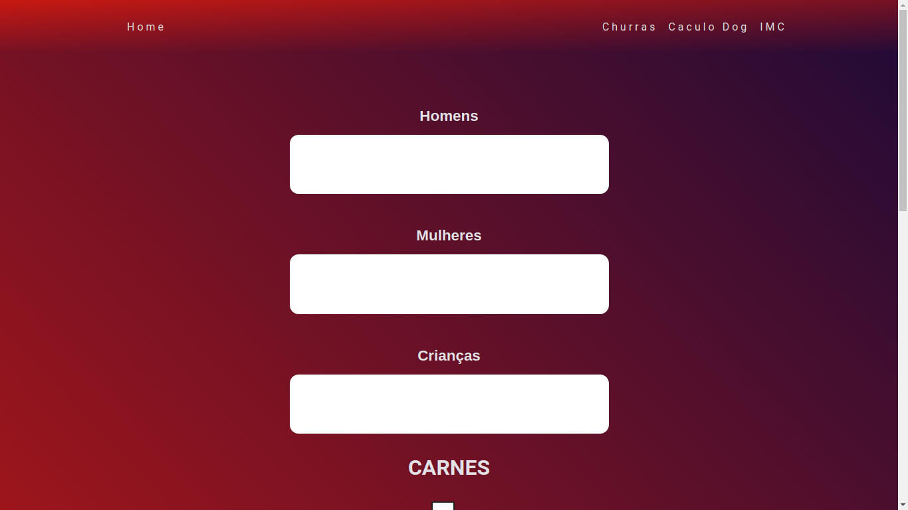

<h1 align="center"> <strong>Calculo de Tudo</strong></h1>

<p align="center">

<h1 align="center">
    
     
      

</h1>


# 📕 About
👶 Happy is an application that connects people to institutional care homes to make many children's day happier.

# 📌 Table of Contents
- [🛠️Technologies](#---technologies)
- [🚀Features](#--features)
- [🏃Getting Started](#--getting-started)
- [📝License](#--license)


# 🛠️Technologies 

This project was made using the follow technologies:

- [React](https://reactjs.org)
- [NextJS](https://nextjs.org/)
- [TypeScript](https://www.typescriptlang.org/)


# 🚀Features

*  View Orphanages located in your city.
*  View details of each orphanage.
*  Register new orphanages.
*  Both web and mobile consume the same API as the backend.


# 🏃Getting Started

```sh
#  Clone Repository
$ git clone https://github.com/wesleywcr/CalculoDeTudo.git 
```

```sh
# Install Dependencies
$ yarn install
# Run Web aplication
$ yarn start


```
# 📝License

Released in 2021.
This project is under the [MIT license](./LICENSE)
Made with ❤️ by [Wesley Rodrigues](https://github.com/wesleywcr)🤙👊